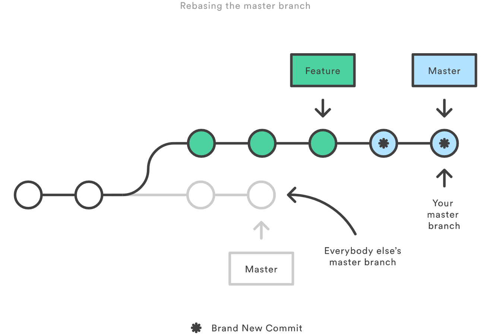

# Rebase

##  Définition

Comme son nom l'indique, **rebase** est là pour changer la « base » d'une branche, **c'est**-à-dire son point de départ. Elle rejoue une série de commits à partir d'une nouvelle base de travail.

Pour cela, il faut réecrire l'historique de commit de git.

## Mettre son développement à la suite de master

C'est à dire prendre toutes les modifications qui ont été validées sur sa branche et les rejouer en repartant de master. De cette façon, le code de developpement commence à partir d'un master mis à jour.

Variante : prendre toutes les modifications qui ont été validées sur une branche et les rejouer sur une autre.

Mettre a jour sa branche avec la branche master distante : `git rebase origin/master`

\("origin/master" est la reférence vers le master distant de gitlab\)

#### Fonctionnement


1. git recherche de l’ancêtre commun le plus récent des deux branches. \(exemple : master et feature\)
2. git récupére toutes les différences introduites par chaque _commit_ de la branche courante \(feature\)
3. git sauvegarde les différences dans des fichiers temporaires
4. git réinitialise la branche courante sur le même _commit_ que la branche de destination \(master\)
5. git réapplique les sauvegardes dans le même ordre.

Résultat les commits de feature \(en vert\) sont à la suite de tous les commits de master \(en bleu\).


#### Pourquoi utiliser le rebase "manuel"

Cela évite les surprises plus tard au moment de la fusion avec master. La gestion des conflits est géré en local au moment du rebase, et non pas à distance.

Cela permet d'avoir un joli historique, c'est à dire un historique linéaire et simple à relire \(important lorsqu'on a vraiment besoin de lire l'historique\)


En réalisant un rebase avant un merge, vous effectuerez à coup sûr un fast-forward merge, et votre historique sera parfaitement linéaire. Par ailleurs, cette opération vous permet d'écraser tout commit de suivi ajouté lors d'une pull request.


## Réorganiser ces commits avant push

Réorganiser les commits créer lors de son développement avant de les partager avec l'équipe permet de nettoyer un historique désordonné avant de fusionner sa branche dans master.

 rebase interactif : `git rebase -i <nouvelle-base>`

Le mode interractif permet de spécifier à git comment organiser les nouveaux commits.

* **pick**, permet d'inclure le commit. On peut en profiter pour changer l'ordre des différents commit
* **reword**, permet d'inclure le commit tout en ayant la possibiliter de changer le message
* **edit**, permet d'éditer le commit. En séparant en plusieurs commits par exemple
* **squash**, regroupement de plusieurs commits. Combine le commit avec le commit du dessus et permet de changer le message du commit
* **fixup**, comme **squash** mais utilisera le message du commit situé au dessus
* **exec**, permet de lancer des commandes shell sur le commit
* **break**, pause a placer entre 2 lignes \(un 'git rebase --continue' est nécessaire pour continuer\)
* **drop**, supprime le commit
* **label,** crée un label sur le HEAD courant, pour le temps du rebase \(ex: label un\_nom\)
* **reset,** réinitialise le HEAD sur un label \(équivaut a un reset --hard\)
* **merge,** crée un commit de fusion en utilisant le commit de fusion d'origine. \(ex: merge -C a1b2c3 branch-name\)


* Les lignes peuvent être réordonnées \(exécutés de haut en bas\)
* Si une ligne est supprimé ou mise en commentaire, le commit ne sera pas réappliqué et donc il sera perdu.

## Rebase avancé "--onto"

L'option --onto permet de spécifié  2 branches pour recupérer les commits supplémentaire entre les 2, pour les appliquer sur une 3eme branche.

`git rebase --onto master serveur client`

Cela signifie : Extraire la branche client, déterminer les commits depuis l’ancêtre commun des branches `client` et `serveur` puis les rejouer sur `master`

## Les dangers du rebase

* Ne jamais réécrit l'historique de master.
* Ne jamais réécrit l'historique de git s'il a été partagé. Le rebase est à faire que si l'on est seul sur la branche. Les commit existant sont supprimé et de nouveaux sont créé.  Cela va créer des conflits pour les autres utisateurs ou supprimer le travail d'autre personne.
*  Dans le cadre de la revue de code, ne pas utiliser le rebase après avoir créé une pull request. 
* Il est obligatoire d'écraser et donc détruire l'ancien historique ce sa branche distante à chaque push : `git push --force`




## En cas de panique

* Annuler le rebase et revenir à l'état avant le début du rebase : `git rebase --abort`
* J'ai finit le rebase et ce n'est pas bon, tous est cassé !  Grace à `reflog` vous pouvez retrouver le hash du commit avant le rebase, et ainsi revenir en arrière.

```text
git reflog
git checkout -b nouvelle_branche hash_commit_avant_rebase

OU

git reflog
git reset --hard hash_commit_avant_rebase
```

* Si vous avez quand même peur de perdre votre travail, vous pouvez faire une branche pour votre rebase.

```text
# Rebase master dans feature-duplique
git checkout feature 
git checkout -b feature-duplique
git rebase master
```

## Sources












